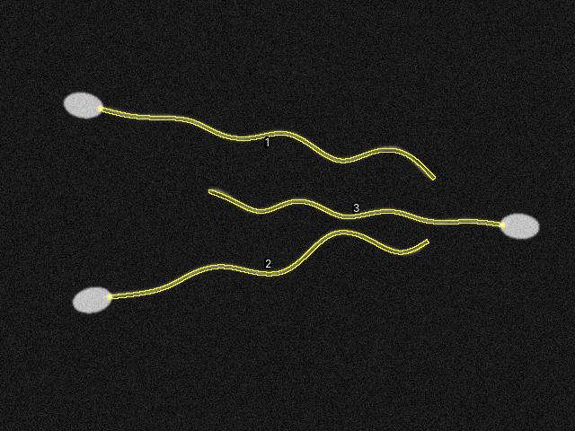

# flagelos.ijm: morfometría de estructuras filamentosas en ImageJ

[](CHANGELOG.md)
[](https://imagej.net/)
[](LICENSE)
[](#exactitud-prueba-con-imagen-sintética)
<!-- pendiente: badge del DOI de Zenodo -->

Macro de ImageJ/Fiji para medir estructuras alargadas a partir de un trazo manual. El trazo se suaviza, se mide su largo y se convierte en una banda de ancho fijo donde se mide la intensidad. Los trazos se exportan junto con los datos para poder revisarlos después.

La hice para medir flagelos de espermatozoides. También sirve para cilios, neuritas, prolongaciones de astrocitos, hifas, fibras de estrés, microvasculatura o fibras musculares, o cualquier cosa que se mida trazando su eje.

<!--
  pendiente: GIF de ~10 s (trazar, F, M) en docs/img/demo.gif
  <p align="center"></p>
-->

<p align="center">
  
  <br><sub>Imagen de control que exporta la macro (imagen sintética de <code>ejemplo/</code>).</sub>
</p>

La idea es que todas las células se midan igual: mismo ancho de trazo, mismo suavizado y mismas mediciones.

## Qué mide y qué exporta

- Largo del eje, en las unidades de la escala.
- Área, media, mínimo, máximo, mediana y densidad integrada dentro de la banda.
- Ancho de la banda en px o en µm.
- Los trazos en un `RoiSet.zip`, que se pueden volver a abrir con la tecla `A`.
- Un archivo con los parámetros usados (versión, escala, ancho, fecha, versión de ImageJ).
- Una imagen con los trazos numerados.

## Instalación

1. Descarga [`flagelos.ijm`](flagelos.ijm).
2. En ImageJ o Fiji: **Plugins ▸ Macros ▸ Install…** y elige el archivo.

Los atajos funcionan hasta cerrar ImageJ. Necesita ImageJ 1.52 o más reciente.

## Uso

| Tecla | Acción |
|-------|--------|
| `C` | Ancho de trazo, en px o en unidades físicas |
| `F` | Guardar el trazo actual como ROI |
| `D` | Deshacer el último ROI |
| `M` | Medir todos los ROIs y exportar |
| `A` | Abrir un `RoiSet.zip` para volver a medir |
| `R` | Reiniciar la sesión |
| `H` | Ayuda |

Pasos:

1. Abrir la imagen y ponerle escala (**Analyze ▸ Set Scale…**).
2. `C` para fijar el ancho de trazo.
3. Con **Segmented Line**, trazar el eje de la estructura (doble clic para terminar).
4. `F`. La barra de estado muestra largo, área y media del trazo.
5. Repetir con cada estructura. `D` borra el último.
6. `M` y elegir la carpeta donde guardar.

### Ejemplo

En [`ejemplo/`](ejemplo) hay una imagen sintética y su salida en [`ejemplo/salida_esperada/`](ejemplo/salida_esperada). Abre la imagen, pulsa `A`, carga el `RoiSet.zip` de la salida esperada y luego `M`. Deben salir los mismos números.

## Archivos de salida

| Archivo | Contenido |
|---------|-----------|
| `<imagen>_resultados.csv` | Una fila por estructura: largo, área, media, mín., máx., mediana, densidad integrada, ancho usado y etiqueta del trazo |
| `<imagen>_RoiSet.zip` | Los trazos, con largo y ancho guardados en cada ROI |
| `<imagen>_parametros.txt` | Versión de la macro y de ImageJ, fecha, escala, unidades y ancho de trazo |
| `<imagen>_control.png` | La imagen con los trazos numerados |

Para juntar los resultados de varias imágenes en una tabla, con resumen por imagen o por grupo:

```bash
python analisis/combinar_resultados.py carpeta_de_resultados/ --grupos grupos.csv
```

## Validación

### Exactitud: prueba con imagen sintética

En [`pruebas/`](pruebas) se generan espermatozoides sintéticos con largo de flagelo conocido, se trazan con la macro en ImageJ y se compara:

| Célula | Largo real (µm) | Largo macro (µm) | Error |
|---:|---:|---:|---:|
| 1 | 49.97 | 49.80 | −0.33 % |
| 2 | 48.17 | 48.00 | −0.34 % |
| 3 | 42.71 | 42.50 | −0.49 % |

También se revisa que al reabrir el `RoiSet` y medir otra vez salgan exactamente los mismos valores. El error es negativo porque un trazo de 12 puntos corta un poco las curvas.

```bash
IJ_JAR=/ruta/a/ij.jar bash pruebas/correr_pruebas.sh
```

### Comparación con medición manual

<!--
  pendiente: figura y tabla con datos reales
  1. llenar analisis/plantilla_validacion.csv (20 a 30 estructuras)
  2. correr analisis/validacion.ipynb (guarda docs/img/validacion.png)
  3. descomentar y llenar con analisis/resumen_validacion.csv
  <p align="center"></p>

| Variable | n | Sesgo | LoA 95 % | CCC de Lin | ICC(2,1) |
|---|---:|---:|---:|---:|---:|
| Largo | | | | | |
| Área  | | | | | |
-->

[`analisis/validacion.ipynb`](analisis/validacion.ipynb) compara la macro con la medición manual (Bland-Altman y CCC de Lin) y calcula la repetibilidad (ICC(2,1)) con los datos de [`analisis/plantilla_validacion.csv`](analisis/plantilla_validacion.csv).

## Calibración del ancho de trazo

El ancho define la banda donde se mide la señal, así que cambia los resultados y hay que calibrarlo:

1. Medir a mano una estructura representativa con el método de siempre.
2. Trazar la misma estructura con la macro.
3. Ajustar el ancho con `C` hasta que el área coincida.
4. Usar ese valor en todas las imágenes.

Si el ancho se pone en µm, la macro lo pasa a píxeles con la escala de cada imagen, así sirve igual con otro objetivo u otro microscopio. El último ancho se guarda para la siguiente sesión.

> **Si usaste la versión 1:** su ancho de trazo probablemente nunca se aplicó. Vuelve a medir tu célula de calibración y no mezcles resultados de la v1 con los de otras versiones. Más detalle en el [CHANGELOG](CHANGELOG.md#200).

## Limitaciones

- El trazo es manual. La macro solo hace que la medición sea igual en todas, no detecta nada sola.
- Un solo ancho por sesión. Si hay estructuras de grosor muy distinto, se analizan por separado.
- Qué células se incluyen o excluyen lo decide quien mide.

## Estructura

```
flagelos.ijm                 la macro
ejemplo/                     imagen sintética + salida esperada
pruebas/                     prueba de exactitud en ImageJ
analisis/                    notebook de validación y script para juntar resultados
docs/img/                    imágenes del README
```

## Cómo citar

Los datos para citar están en [`CITATION.cff`](CITATION.cff) (botón **Cite this repository** en GitHub).

## Licencia

MIT, ver [LICENSE](LICENSE).

---

### English summary

`flagelos.ijm` is an ImageJ/Fiji macro set for measuring filamentous structures (sperm flagella, cilia, neurites, hyphae, fibers) from a manual line trace. The trace is spline-smoothed, its length is measured, and it is turned into a fixed-width band (px or µm) where intensity is measured. Each export saves the results CSV, the ROI set, a parameters file and an overlay image. On synthetic images with known flagellum length the length error is below 0.5 %. Install with *Plugins ▸ Macros ▸ Install…*. Keys: `C` width, `F` save trace, `D` undo, `M` measure and export, `A` reopen ROI set, `R` reset, `H` help.
